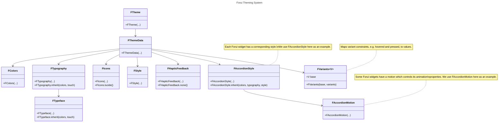

import {Callout} from "fumadocs-ui/components/callout";
import { CodeSnippet } from '@/components/code-snippet/code-snippet';
import gettingStartedSnippet from '@/snippets/snippets/concepts/themes/getting_started/getting_started.json';
import componentsSnippet from '@/snippets/snippets/concepts/themes/components/components.json';
import colorsSnippet from '@/snippets/snippets/concepts/themes/components/colors.json';
import typographySnippet from '@/snippets/snippets/concepts/themes/components/typography.json';
import styleSnippet from '@/snippets/snippets/concepts/themes/components/style.json';
import variantsSnippet from '@/snippets/snippets/concepts/themes/components/variants.json';
import variantsDeltaSnippet from '@/snippets/snippets/concepts/themes/components/variants_delta.json';
import customFontFamilySnippet from '@/snippets/snippets/concepts/themes/components/custom_font_family.json';
import approximateMaterialThemeSnippet from '@/snippets/snippets/concepts/themes/material_interop/approximate_material_theme.json';

export function Theme({title, color}) {
    return (
        <div className="flex items-center space-x-2">
            <div className="h-4 w-4 rounded-full" style={{backgroundColor: color}}/>
            <p className="font-medium">{title}</p>
        </div>
    );
}

Forui themes allow you to define a consistent visual style across your application & widgets. It optionally relies on
the [CLI](/docs/reference/cli) to generate themes and styles that can be directly modified in your project.

## Getting Started

<Callout type="info" title="Theme Brightness">
    Forui does not manage the theme brightness (light or dark) automatically.
    You need to specify the theme explicitly in `FTheme(...)`.

    <CodeSnippet snippet={gettingStartedSnippet} />
</Callout>

Forui includes predefined themes that can be used out of the box. They are heavily inspired by [shadcn/ui](https://ui.shadcn.com/themes).

| Theme                                     | Light Accessor          | Dark Accessor          |
|:------------------------------------------|:------------------------|:-----------------------|
| <Theme title="Neutral" color="#171717" /> | `FThemes.neutral.light` | `FThemes.neutral.dark` |
| <Theme title="Zinc" color="#18181b" />    | `FThemes.zinc.light`    | `FThemes.zinc.dark`    |
| <Theme title="Slate" color="#0f172b" />   | `FThemes.slate.light`   | `FThemes.slate.dark`   |
| <Theme title="Blue" color="#1447E6" />    | `FThemes.blue.light`    | `FThemes.blue.dark`    |
| <Theme title="Green" color="#5ea500" />   | `FThemes.green.light`   | `FThemes.green.dark`   |
| <Theme title="Orange" color="#f54a00" />  | `FThemes.orange.light`  | `FThemes.orange.dark`  |
| <Theme title="Red" color="#e7000b" />     | `FThemes.red.light`     | `FThemes.red.dark`     |
| <Theme title="Rose" color="#ec003f" />    | `FThemes.rose.light`    | `FThemes.rose.dark`    |
| <Theme title="Violet" color="#7f22fe" />  | `FThemes.violet.light`  | `FThemes.violet.dark`  |
| <Theme title="Yellow" color="#fcc800" />  | `FThemes.yellow.light`  | `FThemes.yellow.dark`  |

Each light and dark accessor also contains desktop and touch variants with font sizes and padding optimized for their
respective platforms. For example, `FThemes.neutral.light.desktop` is the desktop variant of the neutral light theme,
while `FThemes.neutral.light.touch` is the touch variant.

See [Responsive](/docs/concepts/responsive) for more details.

## Theme Components



The main components in Forui's theming system:

- **[`FTheme`](https://pub.dev/documentation/forui/latest/forui.theme/FTheme-class.html)**: The root widget that provides the theme data to all widgets in the subtree.
- **[`FThemeData`](https://pub.dev/documentation/forui/latest/forui.theme/FThemeData-class.html)**: Main class that holds:
  - **[`FColors`](https://pub.dev/documentation/forui/latest/forui.theme/FColors-class.html)**: Color scheme including primary, foreground, and background colors.
  - **[`FTypography`](https://pub.dev/documentation/forui/latest/forui.theme/FTypography-class.html)**: Typography, composed of `body` and `display` [`FTypeface`](https://pub.dev/documentation/forui/latest/forui.theme/FTypeface-class.html)s that hold the font family and text styles.
  - **[`FIcons`](https://pub.dev/documentation/forui/latest/forui.theme/FIcons-class.html)**: Icons used by Forui widgets.
  - **[`FStyle`](https://pub.dev/documentation/forui/latest/forui.theme/FStyle-class.html)**: Misc. options such as border radius and icon size.
  - **[`FHapticFeedback`](https://pub.dev/documentation/forui/latest/forui.theme/FHapticFeedback-class.html)**: Haptic feedback callbacks shared across widgets.
  - **[`FVariants`](https://pub.dev/documentation/forui/latest/forui.theme/FVariants-class.html)**: Maps variant constraints, e.g. hovered and pressed, to
    values.
  - Individual widget styles.
  - Individual widget motions.

A `BuildContext` extension allows `FThemeData` can be accessed via [`context.theme`](https://pub.dev/documentation/forui/latest/forui.theme/FThemeBuildContext.html):

<CodeSnippet snippet={componentsSnippet} />

### Colors

The `FColors` class contains the theme's color scheme. Colors come in **pairs** - a main color and its corresponding
foreground color for text and icons.

For example:

- `primary` (background) + `primaryForeground` (text/icons)
- `secondary` (background) + `secondaryForeground` (text/icons)
- `destructive` (background) + `destructiveForeground` (text/icons)

<CodeSnippet snippet={colorsSnippet} />

#### Hovered and Disabled Colors

To create hovered and disabled color variants, use the [`FColors.hover`](https://pub.dev/documentation/forui/latest/forui.theme/FColors/hover.html)
and [`FColors.disable`](https://pub.dev/documentation/forui/latest/forui.theme/FColors/disable.html) methods.

### Typography

The `FTypography` class contains two semantic `FTypeface`s:
* `display` for prominent text such as headings.
* `body` for content and UI text.

An `FTypeface` contains several `TextStyle`s across a scale based on
[Tailwind CSS Font Size](https://tailwindcss.com/docs/font-size). Its text styles only specify `fontSize` and `height`.
Use `copyWith()` to add colors and other properties:

<CodeSnippet snippet={typographySnippet} />

Set an `FTypeface`'s font family via its constructor, e.g. `FTypeface.inherit(fontFamily: ...)`, and use `scale()` to
quickly scale all the font sizes.

<CodeSnippet snippet={customFontFamilySnippet} />

### Icons

The `FIcons` class contains the icon that Forui widgets use. It defaults to [Lucide](https://lucide.dev/) icons in
[`FLucideIcons`](https://pub.dev/documentation/forui_assets/latest/forui_assets/FLucideIcons-class.html)

Pass a custom `FIcons` to [`FThemeData`](https://pub.dev/documentation/forui/latest/forui.theme/FThemeData-class.html) to
swap icons across all Forui widgets.

See the [customizing icons](/docs/guides/customizing-icons) guide for more information.

### Style

The `FStyle` class defines the theme's miscellaneous styling options such as the default border radius and icon size.

<CodeSnippet snippet={styleSnippet} />

### Haptic Feedback

The `FHapticFeedback` class holds the haptic callbacks (e.g. `selectionClick`, `mediumImpact`) that widgets such as
`FPicker`, `FSlider`, and `FTooltip` invoke on interaction. Override it on `FThemeData` to customize or disable haptics
across the entire theme; pass `const FHapticFeedback.none()` to disable them.

### Variants

`FVariants` lets you define a base value with optional overrides for specific variant constraints.

This is useful for expressing a wide range of styling concepts:
- User interaction states, e.g. hovered, pressed.
- Semantic states, e.g. disabled, error.
- Stylistic variants, e.g. destructive and outlined buttons.
- Platform differences, e.g. touch vs desktop.

Each widget defines its own variant type, e.g. `FTappableVariant` and `FCalendarVariant`, ensuring only valid variants
can be used. Constraints are composed using `.and(...)` and `.not(...)`:

<CodeSnippet snippet={variantsSnippet} />

Variants can also be expressed as deltas (modifications) applied to a base value:

<CodeSnippet snippet={variantsDeltaSnippet} />

Resolution uses a [**tiered most-specific-wins strategy**](https://github.com/duobaseio/forui/blob/main/design_docs/shipped/styling_2.0.md#proposed-solution-1)
which is deterministic and order-independent.

Each variant belongs to one of three tiers:
| Tier | Category    | Examples                          |
|:-----|:------------|:----------------------------------|
| 2    | Semantic    | `disabled`, `selected`, `error`   |
| 1    | Interaction | `hovered`, `focused`, `pressed`   |
| 0    | Platform    | `android`, `iOS`, `web`           |

Higher tiers always take precedence.

For example, given the states `{.disabled, .pressed}`, `.disabled.and(.pressed)` wins over `.pressed` because `disabled`
is a tier 2 (semantic) state which outranks tier 1 (interaction) states.

<Callout type="info">
    To learn how to customize `FVariants`, see the [customizing widget styles](/docs/guides/customizing-widget-styles#variants)
    guide.
</Callout>

## Material Interoperability

Forui provides **2** ways to convert [`FThemeData`](https://pub.dev/documentation/forui/latest/forui.theme/FThemeData-class.html)
to Material's [`ThemeData`](https://api.flutter.dev/flutter/material/ThemeData-class.html).

This is useful when:
- Using Material widgets within a Forui application.
- Maintaining consistent theming across both Forui and Material components.
- Gradually migrating from Material to Forui.

A Forui theme can be converted to a Material theme using
[`toApproximateMaterialTheme()`](https://pub.dev/documentation/forui/latest/forui.theme/FThemeData/toApproximateMaterialTheme.html).

<Callout type="warning">
  The mapping is done on a best-effort basis, may not capture all nuances, and can change without prior warning.
</Callout>

<CodeSnippet snippet={approximateMaterialThemeSnippet} />

Alternatively, you can generate a copy of `toApproximateMaterialTheme()` inside your project using the CLI:

```shell copy
dart run forui snippet create material-mapping
```

This is preferred when you want to fine-tune the mapping between Forui and Material themes, as it allows you to modify
the generated mapping directly to fit your design needs.
